<div align="center">

<!-- Terminal SVG with neofetch + CSS animations -->


</div>

<br/>

<!-- TECH ICONS — compact, under terminal aesthetic -->
<div align="center">

```
$ ls ~/toolkit/
```

<table>
<tr>
<td align="right"><code>Languages</code></td>
<td></td>
</tr>
<tr>
<td align="right"><code>Frameworks</code></td>
<td></td>
</tr>
<tr>
<td align="right"><code>Data & Cloud</code></td>
<td></td>
</tr>
<tr>
<td align="right"><code>DevOps & AI</code></td>
<td></td>
</tr>
<tr>
<td align="right"><code>Tools</code></td>
<td></td>
</tr>
<tr>
<td align="right"><code>Services</code></td>
<td>


</td>
</tr>
</table>

</div>

<br/>

<!-- STATS — terminal green theme -->
<div align="center">

```
$ gh stats --user WeipengHu111
```

<br/>


&nbsp;


<br/><br/>


</div>

<br/>

<!-- ACTIVITY -->
<div align="center">

```
$ gh contribution-graph
```


</div>

<!-- SNAKE -->
<div align="center">

<picture>
  <source media="(prefers-color-scheme: dark)" srcset="https://raw.githubusercontent.com/WeipengHu111/WeipengHu111/output/github-snake-dark.svg" />
  <source media="(prefers-color-scheme: light)" srcset="https://raw.githubusercontent.com/WeipengHu111/WeipengHu111/output/github-snake.svg" />
  
</picture>

</div>

<br/>

<div align="center">


</div>
